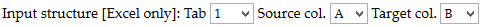
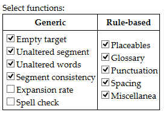

# Veryfire ☆

Veryfire is a quick and dirty prototype with preliminary functionality with the aim to prove the feasibility of the approach (integrating an automated QA routine in VegaSuite).

This documentation describes how to run Veryfire, how it works internally, what requirements the input files must meet and how to handle the output, as well as the instructions to run and understand a demo. A brief development history is also given, followed by a wishlist and a list of issues to be resolved. 

## Input data

### Projects and file types

 Veryfire can parse and analyze bilingual documents, such as Excel 2007/2011 workbooks/spreadsheets with source and target languages in two columns and generic XML-based files such as translated XLIFF and bilingual TMX. Such files can be submitted individually (one by one) or in zipped batches (in .zip format, but not .rar or other) containing only files, not a hierarchy of folders.

It is also possible to send batches of XML files exported from the PISA Portal. In that case, the zipped batch must contain two folders (one with the master/source files, another one with the target files) and a file with the correspondence between source and target files. Each target file must have the same structure as its corresponding master/source file, and the correspondences file must include those folders in the path to the files. See the example below, for target language xxx-XXX and for a zip file that contains folders "Master" and "xxx-XXX": 

```xml
<?xml version="1.0" encoding="UTF-8"?>
<Batch>
  <file id="1">
    <source lang="Master">Master/file1_source.xml</source>
    <target lang="xxx-XXX">xxx-XXX/file1_target.xml</target>
  </file>
  <file id="2">
    <source lang="Master">Master/file2_source.xml</source>
    <target lang="xxx-XXX">xxx-XXX/file2_target.xml</target>
  </file>
  <file id="n">
    <source lang="Master">Master/filen_source.xml</source>
    <target lang="xxx-XXX">xxx-XXX/filen_target.xml</target>
  </file>
</Batch>
``` 

### File name and parameters

 To reduce the need to have explicit input from the user through the upload interface, parameters such as the kind of task (verification or translatability assessement), the project (PISA, INVEDUC, ESENER, etc.) and the locale (or language variant) are fetched from the file name. At this stage, the correct functioning of the utility therefore relies on the submitted files being named correctly (include those data).

Thus, the automatic extraction of parameters from the file name requires that it comply with the following structure: `(Date_*_)(Client_*_)PROJECT_*_Task_ccc-LLL(_*).xxx`, where:

+ parenthesis, i.e. (), encircles optional elements, e.g. the date is optional;
+ the star, i.e. *, stands for anything;
+ the different elements are separated by underscore (i.e. _), in contrast with using the hyphen to separate different parts of one element (e.g. ESENER-2 or esp-GLG);
+ currently `PROJECT` can be PISA, ESENER, ESENER-2 or INVEDUC (any other project must be [notified](mailto:manuel.souto@capstan.be)) and the correct case must be used (e.g. PISA is correct, Pisa is not);
+ `ccc-LLL` is the locale[1], aka language variant (language and country, e.g. eng-IRL for English from Ireland, except for PISA projects, which use an inverted order, e.g. irl-ENG), only relevant or necessary for translated files;
+ the `task` can be either Translation, Adjudication, Verification or Translatability (any other task must be [notified](mailto:manuel.souto@capstan.be)); and
+ `.xxx` is the file extension: .xlf for XLIFF, .tmx for TMX, .xls or .xlsx for Excel and .zip for zipped batches.

 For example:

+ 131222_TNS_INVEDUC_translatability.xlsx
+ PISA_glg-ESP_FNL_F001-CostsOfRunningACar_eng_4-Verification.xlf
+ 140118_ESENER-2_TAFF_esp-ESP_Adjudication3.xlsx

> [1] Two three-digit ISO codes (one for language, one for the country) separated by hyphen are expected, in compliance with cApStAn's locale-coding protocol, e.g. eng-IRL is correct, en-IR or eng_IRL are not. 

### Analyzed data

In the case of XLIFF files, all segments will be analyzed. PISA 2015 XML files will have analyzed only nodes containing text. In the case of Excel files, by default the first worksheet will be analyzed, so you must either make sure that any other worksheets are added after the one containing the translation, or change the default parameter in the user interface. 

 > ⚠️ Bear in mind that hidden columns are also counted. If you are unsure whether your worksheet has hidden worksheets, you can check the worksheet's document properties, which will show all worksheets from first to last. For example, in Microsoft Excel 2013, you will find the sorted list of worksheets at File > Info > Properties > Advanced properties > Contents tab. If you need to unhide a worksheet to reorder them, you can do so by right-clicking any worksheet's tab and choosing Unhide (in Excel) or going to Format > Sheet > Show (in Calc).

The columns considered by default are A for the source language and B for the target language, regardless of the intervention stage (translation, adjudication or verification), but they can also be changed in the user interface when submitting files.

In a nuthsell, default settings for spreadsheets are:

+ Worksheet: 1
+ Source language: col. A
+ Source language: col. B

If you need to change these default parameters, check the instructions below about selecting options in the upload interface. 

## User interface

In order to submit a file and obtain a QA report, you need to follow the next steps. On the user interface, you will see a form with an upload button and a list of options:


### Options

You must review all options to make sure they are correct, or modify any option as appropriate to suit your needs.

#### Input structure [Excel only]

If the input file you submit is an Excel workbook, columns A and B from the first worksheet will be analyzed by default, as explained in the section about analyzed data above. If those default parameters do not correspond to the structure of the Excel workbook you want to submit, you must select the correct ones in this option's dropdown menus before submitting the file. Bear in mind that hidden columns are also counted. 



#### Output format

You may select whether you want to obtain the report in the form of an Excel workbook or as a HTML table. The Excel report is faster to produce, but you need to download it and open it with Excel. On the other hand, the HTML report is slower (especially for large input files), but it will be displayed to you on your browser and there's nothing to download.


When sending batches of several files, a separate report will be issued for each file contained in the zipped batch. 

#### Select checks

If you do (not) want to have certain kind of checks included in the report, you may (un)select the associated function in the menu below:



A specific ruleset will be applied if its name contains any of the selected rule-based functions above.

### Upload form

After you have made sure that all options correspond to your preferences, click on the "Select file" (in Mac) or "Browse" (in Windows) button to browse your machine and select the file that you want to submit to Veryfire. After that, press "Go fire!".


## Encoding checks

This section is not really strictly speaking necessary to run Veryfire, but understanding how the tool works may help users realize how to interpret results better or what is possible to check and what is not, and consequently be more accurate when requesting new checks or rules to be created.

### QA functions and rules

Three concepts are important to understand how Veryfire works: rules, rulesets and QA functions.

#### QA functions

+ They are the parts of the programme that perform checks on each translation unit. Some functions are self-contained and do not need any other input than the translation unit. These functions perform generic checks. On the other hand, other QA functions are a sort of empty template that perform different checks based on the information provided by the rule that is associated with them, but always do so in the same way. Therefore, they perform rule-based checks.

#### Rules

+ They are the containers of some specific and variable patterns that must be searched for in translation units (either in the source and the target, or only in the target regardless of the source). A pattern may be literal (matching only itself) or more general, using wildcards or regular expressions (matching any actual text that corresponds to the generalization of the pattern).

+ Apart from the patterns, rules include other pieces of data, such as the "check type", which tells the algorithm what QA function must be used for that rule; the comment that must be included in the report with the error found by that rule; and then a series of options that alter the check in some way or another (which aren't yet fully implemented, however, some of them being just hard-coded in the function for the time being).

+ Examples of those options are: match something just once or as many times it appears in the other language, match with case sensitivity, match words between word boundaries such as spacing and punctuation or match substrings anywhere in the text, use memoQ-style wildcards, interpret the rule pattern as regular expression or as a literal, etc.).

#### Rulesets

+ Rules are organized/grouped in rulesets, according to the kind of issue they address (placeables, punctuation, etc.). Rulesets are files containing a set of rules, although if rules are stored in a database, the concept of rulesets will disappear and rules will be grouped by some common property. The aim of rulesets is, therefore, simply to store the rules.

### Generic and rule-based checks

As can be inferred from the previous section, two different kinds of checks or check types are possible in Veryfire. On the one hand, generic checks are language- and project-independent and need no input from rules, as they always perform the same action regardless of everything else. For example, the "empty target" function checks that the translation has some content. On the other hand, rule-based checks may be specific to a locale and/or to a project and rely on the patterns provided in the rule and applied by the function. See section **Select checks** above.

### QA functions and check types

The following QA functions perform generic (rule-independent) checks. If the option is selected, that check will be performed on all files submitted.

| Check        | Explanation | 
|:--------------|:---------------------------|
| Empty target  | Checks that, if the source version has some content, the translation must also have some content. If empty or composed of only spacing, an error is reported. |
| Unaltered segment  | Checks whether the translation is identical to the source version, and if so, flags the translation, also reporting whether the spacing and punctuation are also identical. |
| Unaltered words  | Checks whether any of the words from the source version (except those included in an open list of exceptions) appears in the translation. If that's the case, it flags the translation. |
| Segment consistency  | Checks whether the translations of all occurrences of a repeated source language version are identical. If any variants are found, they are flagged. |
| Expansion rate  | Function not fully developed yet: Checks whether the extension of the translation is considered acceptable in relation to the source language segment according to what the parameters for that specific target language. |
| Spell check  | Function not fully developed yet: Checks whether every word is recognized by the Hunspell spell checker. If that's not the case the word is flagged. |

On the other hand, the following rule-dependent check types apply rules which are stored in the rulesets. If the option is selected, rules stored in rulesets containing tagged with the name of the check type in question will be performed on all submitted files.


| Check types  | Explanation |
|:--------------|:---------------------------|
| Placeables  | These rules check consistency in the translation of terminology or similar linguistic units. |
| Glossary  | These rules check consistency in the tranlsation of terminology or similar linguistic units. |
| Punctuation  | These rules check that puntuation is correct according to the target-language conventions or according to the punctuation in the source-language segment. |
| Spacing  | These rules check that puntuation is correct according to the target-language conventions or according to the punctuation in the source-language segment. |
| Miscellanea  | These rules check for the correct translation of aspects other than terminology, placeables, spacing or punctuation. |
| LanguageTool  | Calls the LanguageTool Style and Grammar Check and reports its findings. |


### Rule-based QA functions (technical info)

> You don't need the following information if you are just a normal user. If you're not interested in understanding how Veryfire's internal engine works, you may skip this section.

Each rule provides the information that a QA function applies. The existing QA functions are the following:

| QA function       | Explanation | 
|:--------------|:---------------------------|
| Delimiters  | Checks that the special characters at the beginning and the end of a placeholder are maintained in the translation. Useful to flag mishandling of placeholders whose content must be edited without altering the encapsulating characters. |
| Untranslatable  | Checks that the word matched by the pattern, if present in the source, is also present in the target in identical form. Otherwise, an error is reported. |
| SameNum  | Checks that the entity matched in the source by the pattern provided appears in the target as many times as it appears in the source. If it appears more times, less times or none, an error is reported. |
| Glossary  | Checks that if a given entity/pattern is found in the source, then another given entity/pattern must be found in the translation. If not found, an error is reported. This function is typically used for term consistency checks (for which a glossary and some form of tokenization is necessary) but it can be used as well for any other kind of entity (e.g. punctuation, etc.). |
| Blacklisted  | Checks that if a given entity is found in the source, then another given entity must not be found in the translation. If found, an error is reported. |
| BackReference  | This complex function checks that, if a given pattern is found in the source, some part of that pattern is captured and used as part of the pattern that must be found in the translation. If the target pattern (including part of the text matched by the source pattern) is not found in the translation as many times as in the source, an error is reported. |
| ForeReference  | This complex function checks that, if a given pattern is found in the translation, some part of that pattern is captured and used as part of the pattern that must be found in the source version. If the source pattern (including part of the text matched by the target pattern) is not found in the source version as many times as in the translation, an error is reported. |


### Glossaries

Term consistency checks are based on glossaries, and therefore to check consistency in the use of terminology requires the creation and maintenance of glossaries.

Ideally, terms or expressions should be included in the glossary in their lexematic or dictionary form and without any ancilliary morphosyntactical elements (e.g. articles) which are not really part of the expression and are bound to vary in different contexts. For example, the entry "works council" would be better than "A works council", which wouldn't match the occurrences "the works council", "our works council", etc. Of course, this general recommendation can be overlooked if necessary (e.g. in the case of fixed expressions, or if we want to ensure back-consistency in future projects).

Terms should be in singular form, unless they are lexicalized plurals and always appear in the plural only (e.g. risks and hazards). For example, "psychosocial risks" -> should be "psychosocial risk". Otherwise only occurrences in plural will be matched. Also, unless it is a proper noun or a sentence, a term should be spelled in lower case. For example, "Time pressure" should be included as "time pressure" in the glossary. At the moment, the term check is case-insensitive but going forward it will be sensitive. And vice versa: perhaps "very difficult" should be "Very difficult" because it is a response option.

Bear in mind that different language variants are like different languages altogether for Veryfire.

## Execution

Upon submission of file(s) and the parameters selected in the upload interface, each file is parsed and analyzed separately (if there's only one file, this is done once only) and all translation units are extracted therefrom. On the other hand, based on the project and locale parameters included in the file name, a set of rulesets is selected and each active rule from each ruleset is applied to each translation unit from the file. If the rule finds an error, all the rule-related and translation unit-related data is included in one new row in the report. After applying all rules on all translation units, the report is complete and is printed to the screen or ready for download.

## Output data

When you run Veryfire, you will obtain different kinds of information:

+ Admin data
+ Rules used
+ Report

The administrative information will include date and time of the execution, the file name being analyzed, the locale, the name of the project, and the selected checks. The list of rulesets will include the names of those selected depending on the locale and the project info. See next section about the information included in the report (which is named as `{PROJECT}_{lll-CCC}_{filename}_ {YYYYMMDD}_VF{VF_VERSION}rpt.xlsx`).

### Information in the report

The report contains the following columns:

| Field | Explanation |
|:--------------|:---------------------------|
| Error  | This is simply the error number, for future reference in that report. By default, the rows in the report are sorted by this number. |
| Row/Segment/itemGroup  | Indicates the row's number (in an Excel sheet) or the segment's number (in an XLIFF file) or the itemGroup's ID (in an XML file exported from the PISA portal) for easy location of the error to be fixed or considered. |
| Ruleset:RuleID  | States the name of the ruleset that contains the rule that has detected the error, followed by the number of the rule after a colon. This information is necessary for debugging rules. |
| Function:Pattern  | For rule-based checks, it indicates what function or category applies, followed by what pattern has been searched for. This information is necessary for debugging rules. For generic checks, it just indicates the name of the function. |
| Source segment  | Indicates the source language segment of the translation unit, with the matched expression highlighted in blue, if found. |
| Target segment  | Indicates the target language segment of the translation unit, with the matched expression highlighted in blue, if found. |
| Comment  | Describes the issue and potentially includes some recommendation for fixing it. If the rule contains a comment, this is the comment included in the report. Otherwise, a default message is printed. |


### Feedback and support

Any feedback would be greatly appreciated, feel free to [contact us](mailto:manuel.souto@capstan.be). Also, should you still have any difficulties or questions, do not hesitate to contact us and we will do our best to help you.

