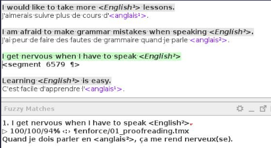

# Authoring source text for translation in OmegaT

## Changing labels that have already been released
 
This relates to small changes made in the source text after that text has been released for translation. The author of that text might come across a label, have after-thoughts and change a comma, remove a space, change a letter's case, etc. In one word: cosmetic and unnecessary changes which should have been applied in time. Not it's too late.

ANY kind of change will break any existing translations of labels that have already entered a translation workflow. Any such changes should be put on hold and then handled through the errata procedure at the agreed moment.

Here's an example of a label where the final stop has been removed, which shows how the segment becomes untranslated and the translation appears as a fuzzy match:

<!--  -->

In this case, judging by the other answer options (which end in full stop) it seems the change is a mistake and not intentional, but that's irrelevant with regards to the consequences of the change (translations are broken and become orphan in any case).

That can have several impacts: more work (and confusion) for the user as they have to handle that segment again, or that might mean no base translation that the user at the next step of the workflow can use to do their task (reconciliation, adaptation, verification, etc.). That could also mean that a workflow gets stuck because the translation of a batch is not completed.

## Using plain Unicode characters instead of HTML markup
 
In a nushell, basically, whenever a character or a symbol exists, that's much preferable over applying formatting to achieve the same or a similar visual or typographic effect. Formatting adds complexity to the translation task and to any other task following translation (editing, helpdesk, etc.), especially in bidirectional languages like Arabic and Hebrew.
 
For example, you might want to use a superscript in the symbol of square meters, and you'll write m2and then select the number and press a button to apply the superindex or superordinate formatting (i.e. to make it smaller and raise it). If you look at the HTML code that you're producing, that will look like `m2`. In the CAT tool (e.g. OmegaT), that will look like `m<g1>2</g1>` and the user will have to insert those two tags also in the translation, otherwise they will get an error and will be unable to commit the target files and move the batch forward. When there are many tags combined in the same segment, it can be from a headache to a nightmare.
 
Instead of using formatting, however, you could have used the actual superindex character, like so: m². That is much easier to translate, it produces no tag errors, and doesn't mess with directionality of the text in bidirectional languages (or it does to a much lesser extent). The user can copy the character from the source text and paste it in the translation, or can use an auto-text shortcut in OmegaT. The list of characters that users can insert with auto-text could perhaps also be useful for you.
 
This is an important aspect where authors can greatly streamline or hamper translation/revision tasks by choosing to use one or another approach.

I hope this all makes sense to you, and you can integrate it as a best practice in your team going forward. Let me know if you have any questions about this. 

In the case of the square meters, the special character is intended to be used also in the target-language version. A special case of the above would involve special characters that you might want in the source text but that the translator might actually not need at all. For example, ordinal indicators: e.g. 1st, 2nd, 3rd, 4th, etc. You might write them like that or might add superscript formatting, producing the same tag as above: **``th``**. For example, the MusicSurvey unit: Paul states: “It is more likely that a randomly picked **9``th``** grade student plays a musical instrument than a randomly picked **10``th``** grade student.”
 
In this case, however, the target language might not use the same styles for ordinal indicators, or might not abbreviate ordinal indicators at all and might use full words instead. But if you used formatting that produces HTML markup, they will have to deal with the tags, even if they don't need them. What users are instructed to do in this case is to just add them at the end of the segment (otherwise, if they are missing, they will get an error, as I mentioned above). 
 
In this case, you could have used just normal letters: **9th**. In fact, I think this is the recommended option in some reputed English style guides (e..g University of Oxford's or the Australian Government). However, if you really really wanted superscript ordinal indicators, you could write something like **9ᵗʰ**.

## Math notation... TBC

Here comes another example about the same topic: `<i>`x`</i>` vs. 𝑥 (as a variable in the context of math notation, of course). 