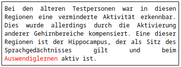
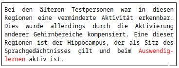
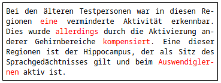

<!-- <h1>Hyphenation internationalization</h1> -->
# Hyphenation internationalization

<!-- <h2>Breaking text manually</h2> -->
## Breaking text manually

Ideally, we should produce translations that are independent of the display mode, and therefore render equally well in different kinds of devices and screens, or different sizes of brower or app windows.

<blockquote class="hyph">
Since different browsers and different operating systems might display the text examples below different, this documentation item uses images (taken on Firefox 107.0 64-bit for archlinux) to ensure homogeneous viewing for all audiences. In any case, the original code used is included below (but commented out) so you can fork this article and play with that.
</blockquote>

<!-- <h3>Hard hyphens</h3> -->
### Hard hyphens

In the text below, the excesive horizontal separation between words in the penultimate line could be unpleasant to the eye.

<!-- 

Bei den älteren Testpersonen war in diesen Regionen eine verminderte Aktivität erkennbar. Dies wurde allerdings durch die Aktivierung anderer Gehirnbereiche kompensiert. Eine dieser Regionen ist der Hippocampus, der als Sitz des Sprachgedächtnisses gilt und beim Auswendiglernen aktiv ist.

-->

<!--  -->

Translators might be tempted (or even instructed) to use a "hard" hyphen character to break the text at the end of the line, and that is likely to seem a good approach to fix layout issues like the one above. In the example below the text looks fine because the hyphen is inserted so as to suit the text box size. 

<!-- 

Bei den älteren Testpersonen war in diesen Regionen eine verminderte Aktivität erkennbar. Dies wurde allerdings durch die Aktivierung anderer Gehirnbereiche kompensiert. Eine dieser Regionen ist der Hippocampus, der als Sitz des Sprachgedächtnisses gilt und beim Auswendig-lernen aktiv ist.

-->

<!--  -->

However, hard hyphens will always be rendered even if they are not needed anymore. That might cause an undesired effect if the size of the text box changes, either because the content must be rendered in another device with a smaller or bigger size screen or simply because the application design turns into a fluid layout, with a dynamic width, to deliver a responsive user experience.

See for example the same text box above with a slightly different size:

<!-- 

Bei den älteren Testpersonen war in diesen Regionen eine verminderte Aktivität erkennbar. Dies wurde allerdings durch die Aktivierung anderer Gehirnbereiche kompensiert. Eine dieser Regionen ist der Hippocampus, der als Sitz des Sprachgedächtnisses gilt und beim Auswendig-lernen aktiv ist.

-->

<!--  -->

Hard hyphens should be avoided both in translations and in the source text.

<!-- <h3>Soft hyphens</h3> -->
### Soft hyphens

An invisible, "soft" hyphen is not rendered visibly directly. Instead, it marks a place where the browser should break the word if hyphenation is necessary.

HTML provides the <code style="color:blue">&amp;shy;</code> named entity to insert a soft hyphen, however for translatability reasons it's always better to use plain Unicode text, i.e. in this case it's invisible character U+00AD (not used here because it's an invisible character). If for any reason it's not possible to use the Unicode character, hexadecimal entityes are always preferable than named entities, e.g. <code style="color:blue">&amp;#x00AD;</code> in this case.

See the result in the same text as above in text boxes of identical size. Here the soft hyphen causes hyphenation because the line wraps at that point:

<!-- 

Bei den älteren Testpersonen war in diesen Regionen eine verminderte Aktivität erkennbar. Dies wurde allerdings durch die Aktivierung anderer Gehirnbereiche kompensiert. Eine dieser Regionen ist der Hippocampus, der als Sitz des Sprachgedächtnisses gilt und beim Auswendig&#x00AD;lernen aktiv ist.

-->

<!--  -->

On the other hand, here hyphenation is unnecessary and therefore no hyphen is produced:

<!-- 

Bei den älteren Testpersonen war in diesen Regionen eine verminderte Aktivität erkennbar. Dies wurde allerdings durch die Aktivierung anderer Gehirnbereiche kompensiert. Eine dieser Regionen ist der Hippocampus, der als Sitz des Sprachgedächtnisses gilt und beim Auswendig&#x00AD;lernen aktiv ist.

-->

<!--  -->

Authors and translators may use soft hyphens when that seems the only way to cause hyphenation in a preview (and this is always preferable to using hard hyphens). The authoring tool or the translation tool, respectively, should provide a practical means to insert that special character. However, internationalized products can be designed in a way that may make this manual approach unnecessary. 

<!-- <h2>Breaking text automatically</h2> -->
## Breaking text automatically

Whereas soft hyphens can be useful as seen above, that method has a clear limitation: it requires knowing in advance where exactly the text might need to be hyphenated, however it's not always possible to foresee where words might need to hyphenate in all different potential layouts and displays. Automatic hyphenation might be more convenient for that reason.

<!-- <h3>Hyphenating with styles</h3> -->
### Hyphenating with styles

CSS provides properties that specify how words should be hyphenated when text wraps across multiple lines. Styling may be used to prevent hyphenation entirely, use hyphenation in manually-specified points within the text, or let the browser automatically insert hyphens where appropriate. Let's look at the third option.

<!-- <h4>Automatic hyphenation by the browser</h4> -->
#### Automatic hyphenation by the browser

Letting the browser hyphenate automatically allows authors and translators to focus on the text and not be distracted by layout issues. If the language expert confirms that results are correct, this approach may be prioritized.

See what automatic hyphenation yields in the two text box sizes considered (differences highlighted in red):

<!-- 

Bei den älteren Testpersonen war in diesen Regionen eine verminderte Aktivität erkennbar. Dies wurde allerdings durch die Aktivierung anderer Gehirnbereiche kompensiert. Eine dieser Regionen ist der Hippocampus, der als Sitz des Sprachgedächtnisses gilt und beim Auswendiglernen aktiv ist.

-->

<!--  -->

And:

<!-- 

Bei den älteren Testpersonen war in diesen Regionen eine verminderte Aktivität erkennbar. Dies wurde allerdings durch die Aktivierung anderer Gehirnbereiche kompensiert. Eine dieser Regionen ist der Hippocampus, der als Sitz des Sprachgedächtnisses gilt und beim Auswendiglernen aktiv ist.

-->

<!--  -->

The drowback of the automated approach is that it depends on the browswer having a hyphenation dictionary available for that language, which might not be the case for lesser used languages. Some research might be necessary to know for which language versions this is the case.

For language versions for which the browser does not have a hyphenation dictionary (if any!), a good compromise could be to use manual hyphenation based on the review for particular layouts. The person responsible for fixing layout issues (including hyphenation-related ones) may insert the soft hyphens based on the results of previewing the text in the most likely display modes. However, the same thing would need to be done again whenever new displays are foreseen.

<!-- <h4>Hyphenation requires engineering</h4> -->
#### Hyphenation requires engineering

In any of the two hyphenation approaches above (both through manual insertion of soft hyphens or based on the browser hyphenation dictionary), the localization engineer must interact with web designers in order to optimize CSS styling in the display application. In the automatically hyphenated language versions, the language tag (e.g. <code>lang="de"</code>) must be correct so that the browser knows settings must be applied.

## References 

[Code](https://jsfiddle.net/msoutopico/0djnp6ck/1/)