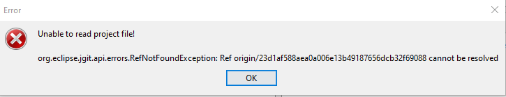
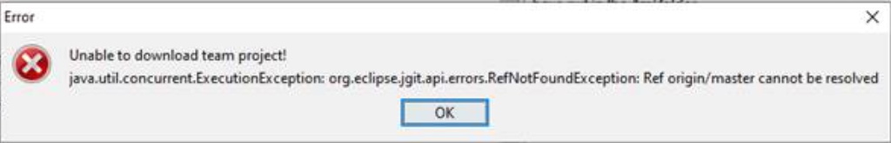
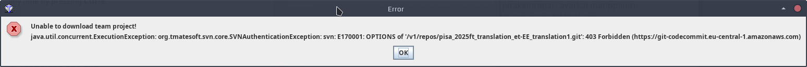
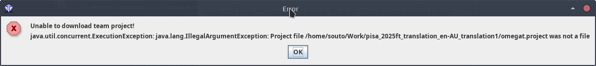

---
tags:
  - Audience꞉ Tech
---

## Unable to read project file! Ref origin/HASH cannot be resolved

The user gets this error when opening the team project:

> Unable to read project file!
> org.eclipse.jgit.api.errors.RefNotFoundException: Ref origin/{hash} cannot be resolved

Likely cause: The user has downloaded the team project in a sync'ed folder (under OneDrive, Dropbox, etc.).

## Unable to download team project! 

The user gets this error when downloading the team project:

> Unable to download team project!
> java.util.concurrent.ExecutionException: org.eclipse.jgit.api.errors.RefNotFoundException: Ref origin/master cannot be resolved

x

Likely cause: lack of support for `main` branches in git projects, it may happen with omegat versions below 5.5.

## Unable to download team project: authentication exception

The user gets this error when downloading the team project:

> Unable to download team project!
> java.util.concurrent.ExecutionException: org.tmatesoft.svn.core.SVNAuthenticationException: svn: E170001: OPTIONS of '{URL}': 403 Forbidden..

Likely cause: Incorrect credentials.

## Unable to download team project: project file was not a file

The user gets this error when downloading the team project:

> Unable to download team project! 
> java.util.concurrent.ExecutionException: java.lang.IllegalArgumentException: Project file /path/to/project/omegat.project was not a file

Likely cause: The OmegaT project does not exist in that branch or is corrupted.

## Socket closed???

---- 

https://imgur.com/v8MGPqd.png

https://imgur.com/klbhChr.png

The error shows that OmegaT failed to upload with credential problem. The user may not have write permissions. 

TransportException =>  https authentication or communication error

git-upload-pack not permitted -> git service deny to accept upload command.

https://docs.aws.amazon.com/codecommit/latest/userguide/troubleshooting-ae.html
https://docs.aws.amazon.com/codecommit/latest/userguide/setting-up-ide-ec.html
https://docs.aws.amazon.com/codecommit/latest/userguide/setting-up-without-cli.html

--

https://imgur.com/2VeicWe.png