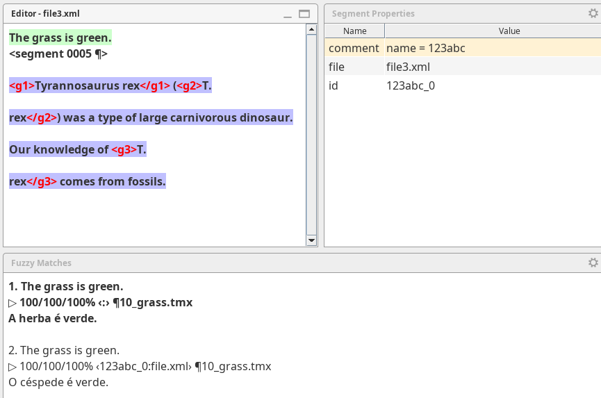
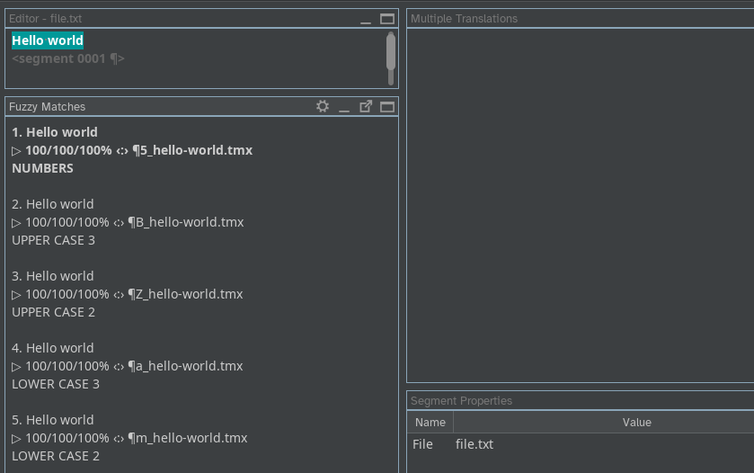

# OmegaT: match sorting specification

<!-- originally shared as https://rentry.org/omegat-match-ranking-specs -->
<!-- originally shared as https://rentry.org/match-ranking-specs (not editable, edit code lost) -->

## Introduction 

The goal of this document is to document match ranking (or sorting) criteria and make them explicit and clear. Documented criteria can help gear new developments, patches and fixes.

To define each criteria, we'll consider two matches and how OmegaT should determine which one is ranked on top of which.

The ranking criteria have an impact on two things: 

+ sorting the matches (that is, what match is displayed above which)
+ selecting the match that is used to auto-populate or pretranslate a segment

The match selected for auto-population or pretranslation will always be the first one, the one on top. In other words, the match selected for auto-population or pretranslation must be ranked higher than any other matches.

## Criteria

The different criteria are: 

1. similarity score
2. auto-population precedence
3. context binding
4. position of the file in the list of files
5. position of the match in the file

### 1. Similarity score

One obvious criteria is similarity score.

#### Decision: 

When considering two matches with different score, the one with higher score must be ranked higher than the one with lower score. 

When two matches have the same score, then other criteria must be used to discriminate between them. 

### 2. Auto-population precedence

Segments can be auto-populated by there mechanisms: 

- Pretranslation (overwriting) and locking with exact matches from `/tm/enforce`
- Pretranslation with exact matches from `/tm/auto`
- Auto-population with a match from any other folder under `/tm` with a score higher than the threshold defined in the preferences when option "Insert the best fuzzy match" is checked in **Preferences > Editor**.

We'll refer to each of the three locations above as "auto-population tier".

An _exact match_ is an identical match, with 100/100/100% score plus no differences in terms of spacing, case or punctuation. Therefore, "exact" is a higher score than "100/100/100%".

The only difference between the first two (`x-enforce` and `x-auto`, respectively) is that the second one (`x-auto`) only happens on untranslated segments, whereas for the first one (`x-enforce`) it makes no difference whether the segment is translated or not.

In any case, the criteria to discriminate between two matches with same score (exact for pretranslation, whatever above the threshold but identical for auto-population) coming from a TM in the same location (any of the three above) must be the same.

#### Decision: 

When considering two matches

+ with the same score,

but one coming from `/tm/enforce` and the other coming from any other location under `/tm`, the match coming from `/tm/enforce` must be ranked higher than the other one. 

When considering two matches 

+ with the same score,
+ one coming from `/tm/auto` and the other coming from any other location under `/tm` other than `/tm/enforce`, 

the match coming from `/tm/auto` must be ranked higher than the other one.

!!! info "Pretranslation vs auto-population"
    Pretranslation is a type of auto-population that happens when the project is loaded, before the use enters a segment and is always based on exact matches. Auto-population stricto sensu happens when the user enters a segment and it can be based on matches of any score above the pre-defined threshold.

When two matches have the same score and come from the same TMX file, then other criteria must be used to discriminate between them. 

### 3. Context binding

!!! note
    Only considered for auto-population, not for sorting. See screenshot below:

    

Matches can be based on:

- the source text
- context
	- filename

The context of the segment can be either prev/next segments or some identifier, such as the segment ID or a resname. The filename is an optional part of the context. If both the source text and the context match when comparing the match with the segment, then the match is said to have context binding.

Matches in a TMX file under `/tm` may have context added as properties (`<prop>` elements): 

```
    <tu tuid="xyz456_0">
      <prop type="file">filename.xlf</prop>
      <prop type="id">xyz456_0</prop>
      <tuv xml:lang="en">
        <seg>foo</seg>
      </tuv>
      <tuv xml:lang="ta">
        <seg>bar</seg>
      </tuv>
    </tu>
``` 

!!! info "ICE matches" vs "alternative translations"
    Context-bound matches are generally called "in-context exact matches" (or ICE matches). In OmegaT jargon, they are called "alternative translations".

#### Decision: 

When considering two matches that:

+ have the same score 
+ come from the same auto-population tier

and one match has context binding, then the match with context binding must be ranked higher than the other one.

The match with context binding will be ranked higher than the other one even if it has a lower auto-population tier (context-binding wins).

When the two matches have the same score, come from the same auto-population tier and none of them has context binding (or both have the same context binding, i.e. same context properties), then other criteria must be used to discriminate between them. 

#### 4. Position of the TMX file in the list of files

Files under `/tm` are sorted by descending alphabetical order. Assuming that only ASCII characters are used in the file path, _descending order_ means a top-to-bottom order going from `0` to `9,` then `A` to `Z`, then `a` to `z`.



!!! question 
    What happens with non-Latin or non-ASCII characters? how are they sorted? This should not be left to the OS's default behaviour.

#### Decision: 
When considering two matches that 

+ have the same score
+ come from the same auto-population tier
+ have no context binding (or the same binding properties)

but they don't come from the same TMX file, then the match with the file path sorted higher will be ranked higher than the match with the file path sorted lower.

When the two matches have the same score, come from the same auto-population tier, have no context binding (or the same binding properties) and come from the same TMX file, then other criteria must be used to discriminate between them. 

#### 5. Position of the match in the file

Entries (`<tu>` elements) in a TMX file appear sequentially in different lines, insde the body. 

```xml
  <body>
<!-- Default translations -->
    <tu>
      <tuv lang="en">
        <seg>Hello world</seg>
      </tuv>
      <tuv lang="ta">
        <seg>NUMBERS top</seg>
      </tuv>
    </tu>
    <tu>
      <tuv lang="en">
        <seg>Hello world</seg>
      </tuv>
      <tuv lang="ta">
        <seg>NUMBERS bottom</seg>
      </tuv>
    </tu>    
  </body>
``` 

The TMX file is read top to bottom, and the corresponding matches are displayed in the Matches pane in the same order that they appear in the TMX file

<!--  -->


#### Decision: 
When considering two matches that 

+ have the same score
+ come from the same auto-population tier
+ have no context binding (or the same binding properties)
+ come from the same TMX file, 

then the match that appears closer to the top of the TMX file will be ranked higher than the match which appears closer to the bottom of the file.

## Summary

